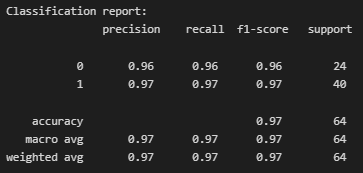

# A CNN Approach to Classifying Concrete Crack with MobileNetV2
There are several common forms of concrete cracks, including hairline cracks that typically appear in concrete foundations as the concrete dries, shrinkage cracks that arise when the concrete dries, and settlement cracks that occur as part of the concrete moves. When the earth beneath the slab is not compacted adequately, concrete might sink, and structural flaws can appear as a result of poor construction. If not quickly detected and corrected, concrete fractures can jeopardize a building's stability and safety. As such building a model which can accurately predict the cracks as they happen is crucial.

Transfer learning is used in the creation of this project to speed up the training phase by utilizing a pretrained model called the [MobileNetV2](https://arxiv.org/abs/1801.04381). 

## Steps Taken

### Step 1 - Data loading  

> The image dataset obtained from [Çağlar Fırat Özgenel](https://data.mendeley.com/datasets/5y9wdsg2zt/2) is loaded into the project and split between training and valiadtion at a ratio of 80:20 using keras.
  
### Step 2 - Data inspection  

> A few images from the train dataset is displayed to make sure that the images are loaded properly.

   
  Sample image of the data in the train dataset.

  

### Step 3 - Data preparation  

> The validation dataset is split again into a validation and test dataset. All three datasets are then converted into Prefetch Dataset. An image augmentation layer is then defined with random flip, random rotation and random zoom function. The image augmentation layer is then tested by applying it to an image and displaying the image after it had been augmented.

   
  Image augmented by the image augmentation layer.

  

### Step 4 - Model development  

> MobileNetV2 is used as the base model for the project. The prepocess input for the MobileNetV2 is used as the normalization layer precede by the image augmentation layer that was created in the previous step. A classifier with a GlobalAveragePooling2D, a Dropout layer and a Dense layer is made to classify the output obtain from the base model. Three callbacks function are used during the model training namely, TensorBoard, EarlyStopping, ReduceLROnPlateau and ModelCheckpoint. The training process of the model is monitored through TensorBoard.

   
  Accuracy changed during model training with the pink line as training and the green line as validation.

 

### Step 5 - Model evaluation  

> The model is evaluated with a classification report and the detailed results of the prediction made by the model are shown in the [Results](#results) section below.

### Step 6 - Model saving

> The model is saved into a h5 file to be loaded for deployment.

## Results
The classification report created with the prediction made by the model can be seen below. The model scored 100% in all F1-score and accuracy. The model might be too complex for the datasets provided and it might be better to consider a custom model instead of using a pretrained model.

 

   
  Classification report for the prediction made by the model.

  

The project needs to be investigated and researched further in order to ascertain whether it is truly able to accurately predict the cement cracks or not.

## Usage steps
> To run the python file, you need to download the dataset from [here](https://data.mendeley.com/datasets/5y9wdsg2zt/2) and extract it into a new folder named dataset in the project path. The path of the dataset folder should be <PROJECT_PATH>/dataset/Concrete Crack Images for Classification/.

## Model Architecture

 

   

  

## Acknowledgement
A huge thanks to [Çağlar Fırat Özgenel](https://data.mendeley.com/datasets/5y9wdsg2zt/2) for sharing the dataset used for this project!  
Thanks to the team who develop and publish the [MobileNetV2](https://arxiv.org/abs/1801.04381) model used in this project.
